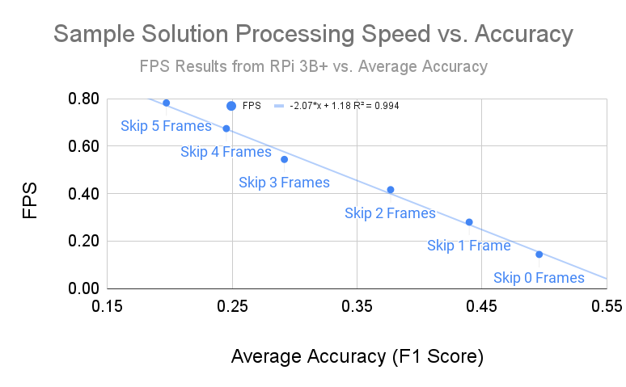

# LPCVC-21 Sample-Solution



#### *_Results Obtained on Sample Data_

# Sample Solution Install and Details can be found [here](solution/README.md).

## Submission Instruction
_Notice: The names of files or folders are sensitive._

Each team should submit only one file, `solution.pyz`: the zipped package of `solution/`. You should use __[zipapp](https://docs.python.org/3/library/zipapp.html)__ to create the `.pyz` file from your solution folder.
```
└── solution/
    ├── environment.yml
    ├── __main__.py
    ├── main.py
    └── other modules and resources
```
* `environment.yml`: Include all your dependencies. Make sure their versions are compatible on the Raspberry Pi .
* `__main__.py`: Used to run `solution/`. DO NOT modify.
* `main.py`: The script that we will use to execute your solution. 
* `other modules and resources` (optional): Any other modules that `main.py` needs to import and any other files that you use in your solution.

### Creating `.pyz` files
We recommend zipping your solution using the following command. It adds a shebang line that we are able to use to identify what version of Python you are using.
```
python3 -m zipapp solution -p='/usr/bin/env python3.8'
```
The valid version of Python for the challenge is the latest patch version of CPython 3.8 for the AArch64 architecture. The command above specifies the shebang of your solution.
If you intend on using a different version of Python, please contact the organizers as soon as possible via Slack.

### Output
Your solution is expected to generate `[video]_out.csv` files under `./outputs/` folder when run.    
For example:
```
├── solution.pyz
└── outputs
    ├── 5p4b_01A2_out.csv
    ├── 4p1b_01A2_out.csv
    └── ...
```   
We will run your code using the follow command:
```
  $ unzip solution.pyz -d solution/
  $ cd solution/
  $ conda env create -f environment.yml --name [ENV_NAME]
  $ cd ../
  $ conda activate [ENV_NAME]
  $ python3 solution/ [video].mp4 in_[video].csv
```

